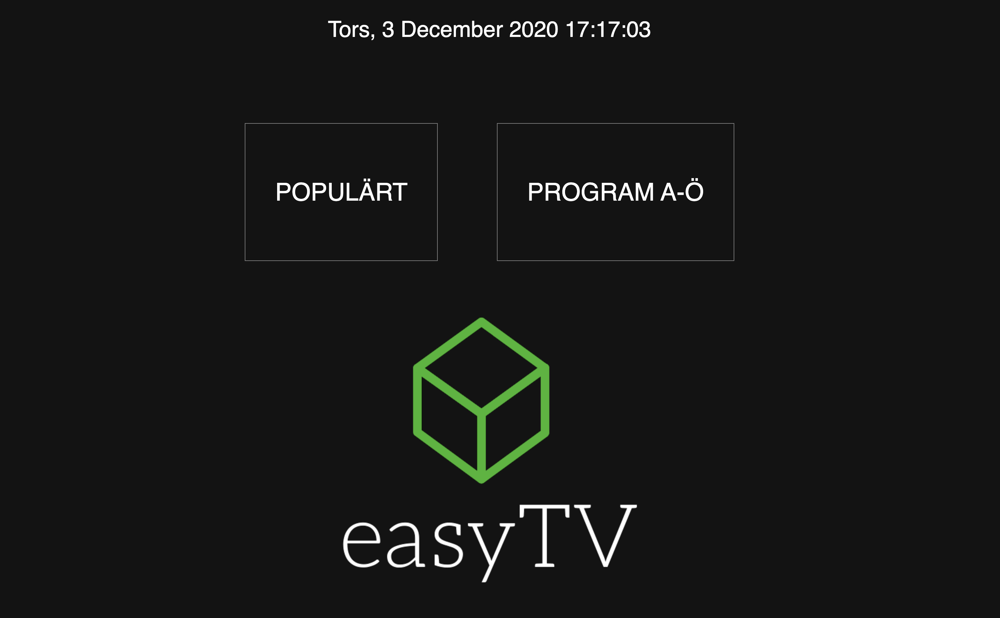
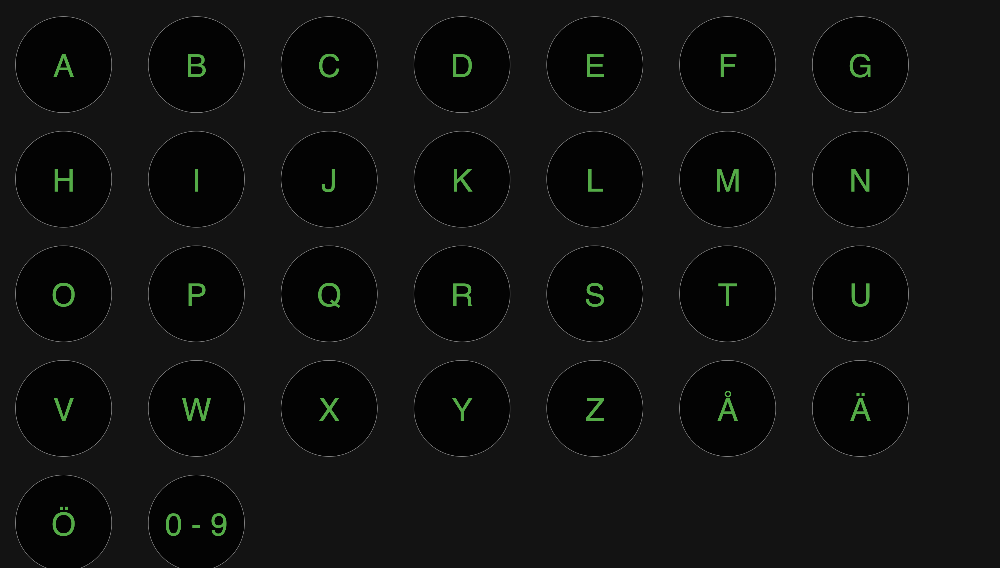
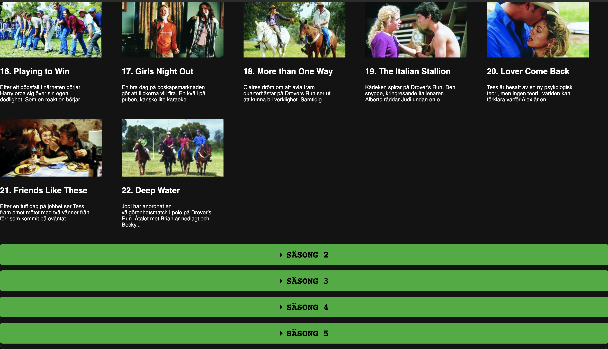

  

# easyTV

  
  
  

# A modern, fast and intuitive SvtPlay application.

#### Built using React and [SvtPlayApi](https://github.com/VGDev1/SvtplayApi)

# Table of Contents

- [A modern, fast and intuitive SvtPlay application](#A-modern,-fast-and-intuitive-SvtPlay-application.)
- [Table of Contents](#table-of-contents)
  - [What does it do?](#what-does-it-do)
  - [Features](#Features)
  - [Installation](#Installation)
    - [Frontend](#Frontend)
    - [API](#API)
  - [Requirments](#Requirments)
  - [Run](#Run)
    - [React app](#React-app)
    - [Backend](#Backend)

## What does it do

This application provides and easier way to use SvtPlay, built for people just wanting simplicity and speed. This can be achived by building an api with autocache and by using React in the frontend.

## Features

#### Intuitive and easy to read homepage

## 

#### Popular page

## 

#### Programs A-Ö page

## 

#### Programs on A page

## 

#### Episodes page

## 

#### Seasons page

## 

#### Player

## 

## Installation

#### Frontend

1. Clone this repository: `git clone https://github.com/VGDev1/EasyTvReact`
2. Change directory: `cd EasyTvReact`
3. Install the requirments: `npm install`

#### API

1. Clone this repository `git clone https://github.com/VGDev1/SvtplayApi`
2. Change directory to project root `cd SvtplayApi`
3. Install the requirments: `npm install`

## Requirments

- Node
- Nodemon
- Redis

## Run

#### React app

1. Change directory: `cd EasyTvReact`
2. Start node: `npm start`

#### Backend

1. Change directory to project root `cd SvtplayApi`
2. Start Redis server: `redis-server`
3. Start cors proxy: `npm run proxy`
4. Start api: `npm run api`
